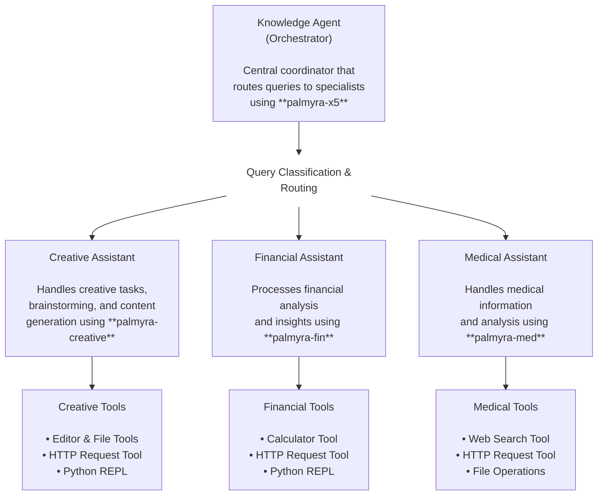

# WRITER Strands multi-agent architecture example
This example demonstrates how to implement a multi-agent architecture using Strands Agents, where specialized tool functions work together under the coordination of a central Knowledge Agent. The system uses natural language routing to direct queries to the most appropriate specialized tool based on subject matter expertise.

## Table of contents

- [Prerequisites](#prerequisites)
- [Installation & setup](#installation--setup)
- [Architecture diagram](#architecture-diagram)
- [How it works and component implementation](#how-it-works-and-component-implementation)
  - [Knowledge agent (orchestrator)](#1-knowledge-agent-orchestrator)
  - [Specialized agents](#2-specialized-agents)
- [Tools used overview](#tools-used-overview)
    - [How each assistant uses their tools](#how-each-assistant-uses-their-tools)
- [Sample interactions](#sample-interactions)

## Prerequisites

Before you begin, make sure you have:

- Python 3.10 or higher installed.
- A [WRITER AI Studio](https://app.writer.com/register) account.
- A WRITER API key. See instructions in the [API Quickstart](/home/quickstart).
- Basic familiarity with Python and [AWS Strands](https://strandsagents.com/latest/).

## Installation & setup

To use WRITER models with Strands Agents, install the optional WRITER dependency:

```bash
pip install 'strands-agents[writer]'
```

**Note:** To follow along with the examples in this guide, you'll also need the [Strands Agent Tools package](https://github.com/strands-agents/tools). Install the package with `pip install strands-agents-tools`.

### Environment Configuration
If you haven't already, copy the `.env.template` file to a `.env` file in the project root with your WRITER credentials:
```
cp .env.template .env
```
**Note:** You only need to fill in the WRITER API key for this example.

```
#WRITER credentials
WRITER_API_KEY=your WRITER API key
```

### **Run the example:**
1. Ensure your virtual environment is activated
2. Run the Knowledge Agent (main orchestrator):
    ```bash
    cd strands-examples/writer/multi_agent_example/
    python knowledge_agent.py
    ```
    
The Knowledge Agent will route your queries to the appropriate specialized tool functions (Creative, Financial, or Medical) based on the content of your question.

## Architecture diagram



## How it works and component implementation

### 1. Knowledge agent (orchestrator)

The `knowledge_agent` acts as the central coordinator that analyzes incoming natural language queries, determines the most appropriate specialized agent, and routes queries to that agent. All of this is accomplished through instructions outlined in the [KNOWLEDGE_AGENT_PROMPT](https://github.com/writer/aws-examples/blob/7536124dfe8585fed93aac1b73d868484b8d6596/strands-examples/writer/multi_agent_example/knowledge_agent.py#L40-L45) for the agent. Furthermore, each specialized agent is part of the tools array for the orchestrator agent. 

**Implementation:**

```
knowledge_agent = Agent(
    model=writer_model,
    system_prompt=KNOWLEDGE_AGENT_PROMPT,
    callback_handler=None,
    tools=[med_assistant, fin_assistant, creative_assistant],
)
```

- The orchestrator suppresses its intermediate output by setting `callback_handler` to `None`. Without this suppression, the default `PrintingStreamHandler` would print all outputs to stdout, creating a cluttered experience with duplicate information from each agent's thinking process and tool calls.

### 2. Specialized agents

Each specialized assistant is implemented as a Strands tool function using the `@tool` decorator with domain-specific capabilities. This architecture allows us to create specialized functions that focus on particular domains, leverage domain-specific models, and process queries within their expertise. 

**For example:** 

The Financial Assistant handles processing financial analysis, insights, and concepts using the calculator tool.

**Implementation:**

```python
@tool
def fin_assistant(query: str) -> str:
    """
    Process and respond to financial questions using a specialized agent with model well-trained for answering financial questions.

    Args:
        query: The user's financial question

    Returns:
        A detailed response
    """
    # Format the query for the financial agent with clear instructions
    formatted_query = (
        f"Please address this financial question. "
        f"Explain main concepts, use special financial terminology: {query}"
    )

    try:
        print("Routed to Financial Assistant")
        writer_model = WriterModel(
            client_args={"api_key": os.getenv("WRITER_API_KEY")}, model_id="palmyra-fin"
        )

        # Create the financial agent
        fin_agent = Agent(
            model=writer_model,
            system_prompt=FINANCIAL_ASSISTANT_PROMPT,
        )
        agent_response = fin_agent(formatted_query)
        text_response = str(agent_response)

        if len(text_response) > 0:
            return text_response

        return (
            "I apologize, but I couldn't process your financial question. "
            "Please try rephrasing or providing more specific details "
            "about what you're trying to learn or accomplish."
        )

    except Exception as e:
        # Return specific error message for fin questions processing
        return f"Error processing your financial query: {str(e)}"
```

## Tools used overview

The multi-agent system utilizes several tools to provide specialized capabilities:

1. `calculator`: Advanced mathematical tool powered by SymPy that provides comprehensive calculation capabilities including expression evaluation, equation solving, differentiation, integration, limits, series expansions, and matrix operations.

2. `python_repl`: Executes Python code in a REPL environment with interactive PTY support and state persistence, allowing for running code snippets, data analysis, and complex logic execution.

3. `shell`: Interactive shell with PTY support for real-time command execution that supports single commands, multiple sequential commands, parallel execution, and error handling with live output.

4. `http_request`: Makes HTTP requests to external APIs with comprehensive authentication support including Bearer tokens, Basic auth, JWT, AWS SigV4, and enterprise authentication patterns.

5. `editor`: Advanced file editing tool that enables creating and modifying code files with syntax highlighting, precise string replacements, and code navigation capabilities.

6. `file operations`: Tools such as `file_read` and `file_write` for reading and writing files, enabling the agents to access and modify file content as needed.

### How each assistant uses their tools

#### Creative assistant (palmyra-creative)
- **Editor & File Tools**: Creates and edits creative content, stories, scripts, and marketing materials
- **HTTP Request Tool**: Fetches inspiration from external APIs, accesses creative resources, and gathers reference materials
- **Python REPL**: Generates creative algorithms, processes creative data, and creates custom creative functions

#### Financial assistant (palmyra-fin)
- **Calculator Tool**: Performs complex financial calculations, computes investment returns, and analyzes financial ratios
- **HTTP Request Tool**: Fetches real-time market data, stock prices, and financial news from external APIs
- **Python REPL**: Executes financial modeling scripts, analyzes datasets, and creates custom financial analysis functions

#### Medical assistant (palmyra-med)
- **Web Search Tool**: Researches medical information, latest studies, and clinical guidelines from reputable sources
- **HTTP Request Tool**: Accesses medical databases, drug information APIs, and healthcare resources
- **File Operations**: Manages medical documentation, patient records, and research files


## Sample interactions

**Example 1: Creative question**

```
> Help me brainstorm ideas for a science fiction novel about time travel

Routed to Creative Assistant

Routed to Creative Assistant
Buckle up, space-time traveler! Here are some mind-bending science fiction novel about time travel ideas to get you started:

1. "The Chrono-Cartographers":
In a world where time is a malleable map, cartographers called Chrono-Cartographers chart and trade in temporal territory. When a group of rogue cartographers creates a temporal singularity, a young cartographer named Lyra must navigate the ever-shifting timestream to prevent a catastrophic convergence of parallel universes.

Time Travel Mechanism: Lyra uses a sentient, map-like artifact known as the "Chrono-Sphere" that allows her to traverse and manipulate the fabric of time.

2. "The Memory Keepers":
In a dystopian future, humanity's memories are harvested and stored in a massive, ancient computer known as the "Archivium." When a brilliant scientist named Kael discovers a way to upload consciousness into the timestream, he becomes the target of a powerful organization known as the "Obliates," who will stop at nothing to erase entire eras of history.

Time Travel Mechanism: Kael uses a neural implant called the "Chrono- key" that allows him to upload and download memories directly from the Archivium.

3. "The Time Reavers":
In a world where time is broken, a group of temporal outcasts known as the "Time Reavers" seek to repair the fabric of reality one timeline at a time. Led by the enigmatic and deadly Alistair, the Reavers must navigate through a series of temporal echoes, each representing a different possible outcome of historical events.

Time Travel Mechanism: Alistair uses a rare, otherworldly metal called "Chrono-Steel" to craft temporal resonance engines that allow the Reavers to "surf" through the timestream.

4. "The Last Horologist":
In a world where time is a finite resource, humanity's last hope for survival lies with the Horologers, a mystical order of clockmakers who can manipulate the very fabric of time. When the last Horologer, a brilliant but reclusive clockmaker named Eve, discovers a way to build a time machine, she becomes the target of a powerful adversary known only as the "Timekeeper."

Time Travel Mechanism: Eve uses a massive, ornate clockwork device called the "Omega-Oratorio" that allows her to wind and rewind the very fabric of time.

5. "The Temporal Crusade":
In a world where time is a battlefield, humanity is caught in the middle of a war between two rival factions: the Temporal Inquisition, a group of radical fundamentalists who seek to eliminate all forms of time travel, and the Time Reavers' greatest enemy, the enigmatic and powerful Council of the Timestream.

Time Travel Mechanism: The protagonist, a young Inquisitor named Eira, discovers a powerful artifact called the "Chrono-Crux" that allows her to traverse the timestream and manipulate the very fabric of reality.

6. "The Dilation Paradox":
When a group of scientists at the Cern SuperCollider create a stable wormhole, they also create a doorway to a parallel universe where time flows in reverse. As objects and people begin to move between the two universes, a brilliant but reclusive physicist named Maya must navigate the increasingly complex consequences of the Dilation Paradox.

Time Travel Mechanism: Maya uses a cutting-edge technology known as "Chrono-Synclasticity" to communicate with her parallel self and prevent a catastrophic convergence of the two universes.

These ideas are just the starting point for your journey through the vast expanse of science fiction. Remember, the true power of time travel lies not in the destination but in the journey itself. So, buckle up, space-time traveler, and get ready to explore the infinite possibilities of the timestream!Here are some mind-bending science fiction novel about time travel ideas to get you started. I have provided 10 different concepts, each with a unique time travel mechanism and plot. 

Would you like me to expand on any of these ideas or provide more concepts?
```

**Example 2: Financial question**

```
> What are the key differences between traditional IRAs and Roth IRAs?

Routed to Financial Assistant

Traditional IRAs and Roth IRAs have distinct differences in terms of their tax implications, contribution rules, and withdrawal requirements. The main differences are:

1. Tax treatment: Traditional IRA contributions are tax-deductible, and withdrawals are taxed as ordinary income. Roth IRA contributions are made with after-tax dollars, and qualified withdrawals are tax-free.
2. Contribution limits and income limits: Both have the same contribution limits, but Roth IRA contributions are subject to income limits.
3. Required Minimum Distributions (RMDs): Traditional IRAs require RMDs starting at age 72, while Roth IRAs do not have RMDs during the account owner's lifetime.
4. Withdrawal rules: Traditional IRA withdrawals before age 59 1/2 may be subject to a 10% penalty, while Roth IRA contributions can be withdrawn tax-free and penalty-free at any time.

The choice between a Traditional IRA and a Roth IRA depends on individual financial situations, tax brackets, and retirement goals. 

Would you like more information on retirement planning or specific guidance on choosing between Traditional and Roth IRAs?
```

**Example 3: Medical question**

```
> What are the common symptoms and treatment options for diabetes?

Routed to Medical Assistant

Diabetes is a metabolic disorder characterized by high blood glucose levels (hyperglycemia) due to inadequate production or utilization of insulin, a necessary hormone for glucose uptake into cells. Common symptoms of diabetes include:

1. Polyuria: Frequent urination due to high levels of glucose in the urine, which attracts more water from the body, leading to increased urine production.
2. Polydipsia: Excessive thirst and water consumption to compensate for urine losses.
3. Polyphagia: Increased hunger, but no weight gain, due to cells not receiving glucose despite normal caloric intake.
4. Fatigue: Low energy levels despite adequate rest, resulting from muscles and other tissues not receiving necessary energy from glucose.
5. Visual disturbances: Blurred vision, especially for close objects, potentially reversible with tight blood glucose control.

Treatment options for diabetes depend on type and severity:

Type 1 Diabetes (T1D):
- insulin analogs (human insulin mimetics with altered timing of action)
- pancreatic islet cell transplantation (experimental procedure, restricted access)
- continuous subcutaneous insulin infusion (CSII) with insulin pumps
- hybrid closed-loop systems (automated insulin delivery with manual adjustments)
- diet and exercise tailored to reduce glycemic loads during meals.
Type 2 Diabetes (T2D):
- lifestyle modifications: diet and exercise to improve insulin sensitivity and reduce excess fat.
- oral antidiabetic agents that enhance insulin release (sulphonylureas, dipeptidyl peptidase inhibitors)
- insulin sensitizers (thiazolidinediones), which improve cellular response to insulin.
- sodium-glucose co-transporter 2 inhibitors (SGLT-2 inhibitors), which block renal glucose reabsorption.
- injectable glucagon-like peptide-1 receptor agonists (GLP-1 RAs) that increase insulin secretion and reduce glucagon release.
- insulin therapy, which may be necessitated by progressive beta cell failure.

Glycemic targets:
- Normal fasting plasma glucose levels (<6.1 mmol/L or 110 mg/dL).
- Postprandial (2-hour after meal initiation) glucose levels within target ranges specified by providers (typically <7.8 mmol/L or 140 mg/dL).
Treatment plans are personalized considering individual risks, comorbidities, and patient history.Diabetes is a metabolic disorder characterized by high blood glucose levels. Common symptoms include frequent urination, excessive thirst, increased hunger, fatigue, and visual disturbances. Treatment options vary depending on the type and severity of the condition.

For Type 1 Diabetes, treatment typically involves insulin therapy, such as insulin analogs, continuous subcutaneous insulin infusion, and hybrid closed-loop systems. Lifestyle modifications, including diet and exercise, are also crucial.

For Type 2 Diabetes, treatment often begins with lifestyle modifications, such as diet and exercise, to improve insulin sensitivity. Oral antidiabetic agents, insulin sensitizers, and injectable glucagon-like peptide-1 receptor agonists may also be prescribed. In some cases, insulin therapy may be necessary.

Glycemic targets, such as normal fasting plasma glucose levels and postprandial glucose levels, are used to guide treatment plans. These plans are personalized based on individual risks, comorbidities, and patient history.

Would you like more information on managing diabetes or specific guidance on a particular aspect of diabetes care?
```